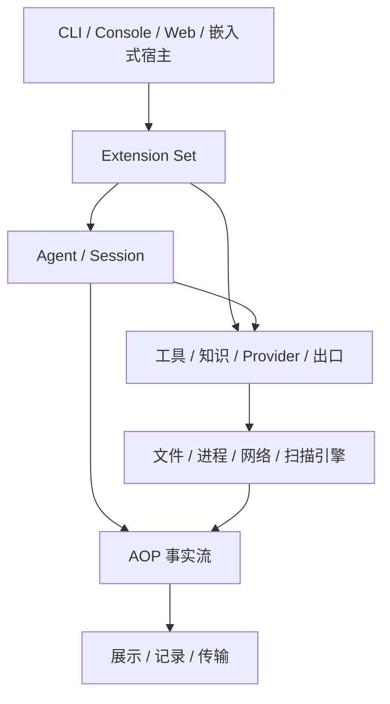
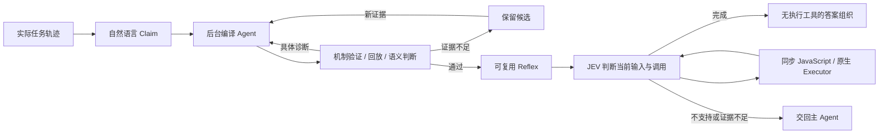

# 架构

[文档首页](README.md) · 前置：[基本概念](concepts.md) · 开发：[构建应用](development.md)

cyber-harness 将宿主、扩展组合和执行运行时分开：宿主接收输入并管理应用寿命，扩展安装所需能力，运行时使用这些能力推进任务。扫描、审计、Web 与 IOA 由产品入口选择，沿用同一套装配、执行和事件机制。

## 应用结构

`harness.BaseExtensions` 返回有序的基础扩展；`harness.New` 在此之上构造工具宿主或会话 Agent。`cmd/agent` 选择最小本地能力，`cmd/aiscan` 加入扫描器、代理与协作，`cmd/audit` 以独立 Go 模块组合审计工具，`cmd/cyber-web` 提供独立 Hub。产品功能由入口的导入和装配代码决定。

## 扩展装配与生命周期

组合根显式调用 `extension.New(a, b, c)`，按依赖顺序加载：资源所有者在前，贡献者与消费者在后。Set 不推导依赖图，也不通过包的导入副作用发现插件。关闭按相反顺序进行，使消费者收尾时仍能调用依赖。

| 关系 | 所有者 | 使用方 | 用途 |
| --- | --- | --- | --- |
| 多个条目汇入贡献点 | `Define[T]` | `Add[T]` | 工具、命令、知识等贡献 |
| 一个能力供后续扩展借用 | `Provide[T]` | `Use[T]` | Executor、事件流、Provider 状态等共享接口 |

类型本身就是键，接口与具体实现类型是不同的键。借用不能指向自身或后面的扩展；固定业务依赖也可直接通过构造参数传入。全部加载成功后资源注册表冻结，Set 进入 Active；已有贡献点仍可按领域规则增删条目，但不能重新定义资源类型或建立借用。

`scope.Init()` 用于初始化；`scope.Lifetime()` 管理长期工作，不继承 Load context 的取消。Load 失败从失败扩展开始逆序回滚，因此 Close 必须能处理部分初始化。构造拒绝带类型的 nil，Load/Close panic 转为错误；静态贡献无需空的 Close。

关闭一个扩展时，Set 依次取消 Lifetime、撤销资源句柄、调用扩展 Close，最后释放借用。注册表停止新调用并排空在途工作，扩展释放自己拥有的连接、订阅和后台任务。普通关闭错误记录后继续；`ErrCloseIncomplete` 或 context 超时会保留当前扩展及更早依赖，供宿主使用新的关闭 context 重试。

CLI flag、配置 section 和连接检查先在声明阶段贡献，冻结并解析配置后才构造运行扩展。声明不会启动模型、进程或服务。工具安装通过所属 Extension 完成，宿主借用业务接口并持有 Set；扫描流水线的任务 DAG 不参与扩展加载排序。可运行组合与关闭示例见[扩展开发](developer/extensions.md)和[宿主集成](developer/hosting.md)。

## Agent 运行时

Session 持有对话、队列和身份，一次外部提交形成 Turn。Turn 内执行 Agent Run，标准循环每轮请求模型、执行工具、追加结果；Goal Evaluation 还可根据验收反馈执行下一次 Run。外部 Turn、Agent Run 与模型轮次有不同计数和取消边界。

`exts/agent` 安装循环，管理调用准入、取消和排空；`exts/session` 借用循环、Provider、工具、知识和事件流，创建 Runtime。配置变更替换 Profile；终端 `/model` 只影响当前 Session 下一次 Run，正在执行的工作和已有子任务保留快照。

标准循环按以下顺序推进：

1. 检查执行上下文和 Provider，解析本次 Run 的 system prompt，调用 `BeforeRun`。
2. 排空 Inbox，将追加输入放入对话；按窗口和预留空间决定是否压缩。
3. 请求当前 Provider，按错误类型重试或结束。
4. 校验工具调用和 token 预算，执行有效调用，按原调用顺序追加结果。
5. 检查停止条件；继续下一轮，或等待尚未返回的后台结果。

同一响应的工具调用可并行执行，默认上限为 16；批次内没有隐式依赖排序。被输出上限截断的响应不执行工具，缺失 ID、名称或合法 JSON object 参数的调用被拒绝。工具错误与 panic 转为结果交回模型；不可恢复的 Provider 错误结束 Run；取消通过 context 向执行工作传播。

### Inbox 与后台生产者

追问、后台命令完成、子 Agent 回报和 IOA 消息通过有界 Inbox 回到会话。队列有优先级，满队列可能替换较低优先级消息；无法接收时返回错误，不承诺离线保存。

后台工作注册 producer，完成后释放。模型不再调用工具时，循环仍处理待收消息；有活跃 producer 则等待消息或取消，全部结束且队列为空才自然收尾。周期任务和 heartbeat 也通过调度器向 Inbox 提交提示，由模型执行，不是绕过模型的 OS 定时器；进程重启不恢复计划。

### Subagent 委派

`exts/subagent.New()` 拥有唯一的 Subagent 贡献点；`NewTools()` 借用它与 Runtime 安装模型工具。具名定义在 Prepare 中生成任务配置，匿名调用直接执行；运行期撤销定义会取消并排空准备、执行和通知，之后才允许同名注册。

会话子任务继承配置快照，拥有独立历史和 Inbox。sync 等待结果，async 从新对话开始，fork 使用父对话最后一个完整工具批次边界之前的历史。异步任务先完成终态和可选 IOA 记录，再通知父 Inbox 并释放 producer；父会话关闭会取消并等待子会话。

scanner 的 verify/sniper 使用同一贡献点同步执行，可不创建 Runtime Session；其 Session/Turn 事件只用于追踪，不注册对话队列或 IOA 接收器。共享工具环境不提供文件、网络或浏览器隔离。贡献接口见[扩展开发](developer/extensions.md#子-agent-贡献)，日常调用见[Web 与协作](user/web.md#子-agent)。

### 停止条件

| 原因 | 触发条件 |
| --- | --- |
| `completed` | 没有新工具调用、待处理输入或活跃生产者 |
| `terminated` | 工具批次全部请求终止，例如单独调用 `finish` |
| `stopped` | 达到模型轮次上限 |
| `budget` | 达到本次 Run 累计 token 预算 |
| `canceled` | 执行 context 被取消 |
| `error` | 无法继续的执行错误 |

Runtime 在执行结束后发布 `TurnEnded`，包含最终用量与错误；取消受理不代表工作已退出。达到限制、收到最终文本或进程正常退出，都不能单独证明任务达标。宿主应保留停止原因和实际证据。

### Goal Evaluation

评估器在一次 Run 后通过独立模型请求检查轨迹摘要、结果和此前反馈，返回 `pass`、`continue`、`reason`、`feedback`。未通过但可继续时，把反馈作为下一次输入；未通过且选择收尾时仍可正常返回最后结果。

评估默认使用当前 Provider；独立请求不意味着换模型。`--eval-rounds` 限制评估次数，默认硬上限为 20，与 Run 的模型轮次上限不同。连续三次评估请求失败或最后一轮仍失败返回错误；选择不继承上下文时先压缩，失败再重置。操作步骤见[Agent 指南](agent.md#任务推进与控制)。

## JEV 与 Reflex

JEV 的 `choice`、`score`、`noul` 是 Provider 层的原生判断能力，Reflex 学习和执行由 `exts/jev` 管理，Guardrail 独立使用判断能力做工具准入。是否接管当前任务取决于已验证流程、当前输入、约束与实际证据。

每次判断都使用 `type + context + options` 的 Claim；内容身份、临时求值、持久化、编译和普通 Reflex 自举见 [Claim 与 Reflex](jev.md)。

工具通过 `NativeContract` 声明协议版本、读写分类和同一操作身份的查询方式，不承担业务完成判断。编译 Agent 只能检查真实证据和提交代码，不能执行用户工具；同一个 Agent 根据结构化诊断持续修复，取消或服务不可用保留候选，缺少能力或证据则等待补充。

发布 Reflex 前检查语法、参数 schema、步骤 manifest、原生契约、有限分支、已记录轨迹和入口 report。至少完成一条完整回放，源码 hash、轨迹 hash 与契约版本绑定到资格记录，未覆盖分支仍显式保留。回放通过只证明能解释已有轨迹，当前任务仍需要输入、调用与完成判断。

运行使用同步 JavaScript，经原生 Executor 调用工具。宿主检查参数、读写分类、次数边界和证据引用；副作用身份由任务、步骤和 occurrence 构成，同一身份参数变化会拒绝，未知结果阻止新写操作。两次有意重复操作使用不同 occurrence；只有原生契约确认同一操作状态才能解除未知。账本不提供进程重启恢复或跨进程 exactly-once 保证。

JEV 拒绝、超时、参数缺失、能力不支持或证据不足时交回主 Agent，保留原因与已有结果。完成后的答案组织不能调用执行工具；编译、参数提取、判断和答案组织的模型用量分别计入成本，缺失用量不算零费用。

默认关闭接管；`mode: auto` 启用，`learning: frozen` 只复用已有合格流程，禁止学习和编译。配置、请求超时和显式编译期限见[配置指南](configuration.md#jev--reflex)。旧资格不符合当前契约时退出可执行集合，保留备份及可验证候选；通过当前验证后才能复用。任务覆盖与节省效果需要按场景验证，不能从少量成功推断所有任务都能替代或降低费用。

## 执行环境

### 工具与命令的执行链

Tool Registry 提供模型可见的结构化工具，Command Registry 提供命令行能力；`bash` 是 Tool，扫描器与 `proxy` 等可作为 Command。两者有独立贡献点和执行契约，共用注册表的撤销与排空机制。

`BashTool` 用 `mvdan.cc/sh/v3/interp` 处理变量、shell builtin、重定向、管道和条件执行，展开后的 argv 经 `core/tool.RunCommand` 派发。已注册 Command 优先于 PATH 同名程序；其余按调用的目录、环境、PATH 和标准流启动 OS 进程。单独启动的 shell 不访问进程内注册表；工具入口本身不创建容器或文件系统沙箱。

工作注册表统一跟踪 PTY 进程、pipe 进程、进程内函数和外部子系统工作，共享状态、输出与停止接口。只有 OS 进程拥有真实 PID 和进程退出码，解释器保存逻辑状态；消费者还需检查终态与错误。后台任务将取消范围交给 Manager，完成后通过 Inbox 通知；关闭按 interrupt、terminate、kill 逐级推进并排空资源。

文件扩展拥有 root 与只读 URI mount，路径、类型、大小限制作用于文件工具。写入使用同目录临时文件和 rename，失败保留原文件，不隐式创建父目录，也不承诺 fsync 或跨平台原子性；外部命令仍按宿主权限访问文件。完整参数与后台命令操作见[工具指南](user/tools.md)。

### 工具准入

Registry 调用经过 `core/tool/hooks.Execute`。Guardrail 在 `tool.before` 检查当前参数：`record` 继续执行；`review` 或 `block` 在 auto 下再判断后果，safe 下等待人工审批。拒绝、过期和取消返回错误，审批只唤醒原调用并执行一次，不能覆盖其他 hook 的拒绝。

关闭取消判断和待审批工作，再撤销处理器并排空调用。审批事件用于展示，重启不恢复可执行审批；已启动进程内部行为与原始 PTY 输入仍由执行环境控制。配置和操作见[工具审批](user/tools.md#工具准入与审批)。

### 网络出口

proxy 扩展发布稳定的 `egress.Endpoint`，内置客户端借用出口，外部程序通过代理与 CA 环境变量接入。默认路由切换影响后续连接；单次 `proxy <url> <command>` 创建带 token 的路由租约，后台工作持有到结束，过期 token 不退回默认出口。

忽略代理环境或使用不支持协议的外部程序不保证被捕获。关闭 MITM 保留路由但停止解密与抓包；HTTPS 捕获需要信任 CA。模型请求的 `--llm-proxy` 独立于工具出口，最小 Agent 使用 `harness.NoEgress()`。命令与捕获限制见[网络与代理](user/tools.md#网络与代理)。

## 上下文与知识

Prompt 扩展按顺序接受具名 section，按请求 target 选择用途；修改在 Document 副本上提交，失败不留下半份结果。system prompt 在一次 Run 的 `BeforeRun` 前解析，运行期间保持不变；提示词指导模型，实际准入由执行边界控制。

Skill 正文由扩展 Bundle 和本地目录提供，同名内容按来源优先级覆盖：Bundle、`.cyber/skills/`、`.agent/skills/`、CLI paths。目录存在不意味着正文全部进入模型请求，按选择和引用渐进读取。`cyber://skills/` 是虚拟文件位置，不是网络地址；scanner 的知识与中立运行时文档由各自扩展贡献。OKF 组织知识与引用，校验命令不会执行正文中的 executor 或 attester。使用方法见[Skills 与知识](user/knowledge.md)。

压缩在窗口减去预留空间后触发，保留最近消息并摘要较早历史，避免从孤立 tool result 切分。空摘要、截断或没有缩短估算长度时不替换原历史；Provider 上下文溢出另有一次恢复机会，失败不会无限重试。压缩是有损的，精确证据应保存在文件或 Artifact 中。

| 限制 | 作用范围 |
| --- | --- |
| `context_window` | 单次请求可容纳的上下文 |
| `max_tokens` | 单次请求的最大输出 |
| Run 的 `TokenBudget` | 本次 Run 累计用量 |

请求前按估算输入裁剪输出预留；估算不是精确 tokenizer，窗口也不是累计计费上限。

### Provider 选择与容错

`openai` 与 `anthropic` 表示线协议，服务商由端点和模型选择。配置可保存多个 profile，但当前实现不会因请求失败自动切换 profile。标准循环对可重试网络和服务错误退避重试，鉴权与参数错误直接返回，上下文溢出走压缩路径。

重试沿用逻辑消息 ID，展示端按 ID 合并流式片段与最终消息，失败尝试的流式正文撤回，已产生的用量保留。配置选择、保存与远端节点模型同步见[配置指南](configuration.md)。

## 事件与数据

| 机制 | 所有的职责 |
| --- | --- |
| `core/hooks` | 执行边界上的控制与观察 |
| `core/operation` | 调用身份、父子关联与取消传播 |
| `core/events.Stream` | AOP 事实事件、ID、时间与序号 |
| `core/eventbus` | 领域内部的类型化通知与有界异步消费 |

hooks 参与当前执行，事件记录已经发生的事实。`--observe` 选择安装的观察器，`-o` 保存实际发出的 canonical Event；未安装的观察项不会因保存日志而自动产生数据。订阅者持有自己的队列和关闭，`Flush` 等待通知，`Close` 停止并排空。

### 协议类型的归属

AOP schema 定义 Agent、Session/Turn、事件和通用 file、tool、PTY 协议；Cyber schema 定义产品命令、扫描、重载和 ConnectRPC 管理服务；功能扩展持有自己的 protobuf namespace。Go 类型分别位于 `aop/`、`core/types/`、`pkg/rpc/` 及扩展包，通过 `cmd/gen` 统一生成。

跨连接使用 protobuf `Any` 包装的 Envelope：`id` 标识操作，`reply_to` 和取消指向原请求。WebSocket 传二进制 Envelope，stdio 传逐行 ProtoJSON Envelope；CLI 历史则是逐行 Event，不能直接作为 stdio 输入。`Event.seq` 是会话语义顺序，`delivery_cursor` 是持久投递位置，两者不能互换。

宿主拥有监听与连接，Runtime 拥有执行状态；Application 与 Node 的 endpoint 和初始注册不同，后续共用连接管理。Web Node ID 与 IOA 身份独立。协议字段见 [API](api.md)，接线与关闭见[宿主集成](developer/hosting.md#连接与协议处理)。

### 记录、恢复与资产

CLI 的 stdout 展示、扫描器原生结果与 `-o` Event JSONL 是不同输出。回看只渲染事件，恢复只重建对话再执行新输入，不恢复进程、浏览器、连接或调度计划；恢复源只读。任务 recap 存在事件历史中，属于展示数据，不进入恢复后的模型上下文。操作见[会话与上下文](user/sessions.md)。

Web 归档原始 Artifact、Loot 与 cursor，按事件 ID 去重，通过 operation 和 `result_id` 关联证据。浏览器 CSTX WASM 将原生产物投影为资产节点，IndexedDB 保存资产、单次操作观测、关联证据与消费位置。历史查询只读所选 operation 及显式子操作，不用全局最新值替代历史。

解析失败保留原事件和错误，存储失败不推进 cursor；失败或取消仍展示已归档证据。派生缓存可重建，Go 不维护平行的 CSTX 事实表；比较中未再次发现一项资产不证明问题已修复。数据库需匹配宿主声明的 schema，程序不会自动删除不兼容旧库；版本升级说明见 [Changelog](changelog.md)。

## 源码与验证

| 位置 | 职责 |
| --- | --- |
| `core/` | 类型资源、注册表、hooks、operation、事件与进程 |
| `agent/` | 模型协议、循环、会话、上下文与子任务 |
| `tools/` | 文件、命令、扫描器等业务实现 |
| `exts/` | 声明和安装能力，持有资源生命周期 |
| `pkg/` | 公共配置、宿主契约、Console、节点与 Web |
| `cmd/` | 产品组合与运行入口 |

`core` 不依赖 `agent`、`pkg` 或 `tools`。从 [BaseExtensions](../pkg/harness/base.go)与 [aiscan Profile](../cmd/aiscan/profile.go)阅读装配，沿 [Session](../agent/session/session.go)进入 [StandardLoop](../agent/loop.go)，再跟进工具与事件。生命周期验证位于 [Extension](../core/extension)和 [Resource](../core/resource)，依赖边界由 `go test ./pkg/internal/architecture` 检查。

JEV 实现入口为[编译 Agent](../exts/jev/compiler_agent.go)、[资格验证](../exts/jev/qualification.go)和[运行时](../exts/jev/runtime_judgment.go)；[原生机制测试](../exts/jev/native_mechanism_test.go)验证回放与完成语义，[修复测试](../exts/jev/compiler_repair_test.go)验证诊断、压缩和候选保留，[Profile 测试](../cmd/aiscan/jev_profile_flow_test.go)验证产品接线。fixture 测试与真实模型实验的范围不同，不能互相代替。

运行条件、入口、产物和判定边界见[仓库 harness](../cmd/harness/README.md)、[Web 前端](../web/frontend/e2e/README.md)和[审计测试](../cmd/audit/tests/README.md)。
