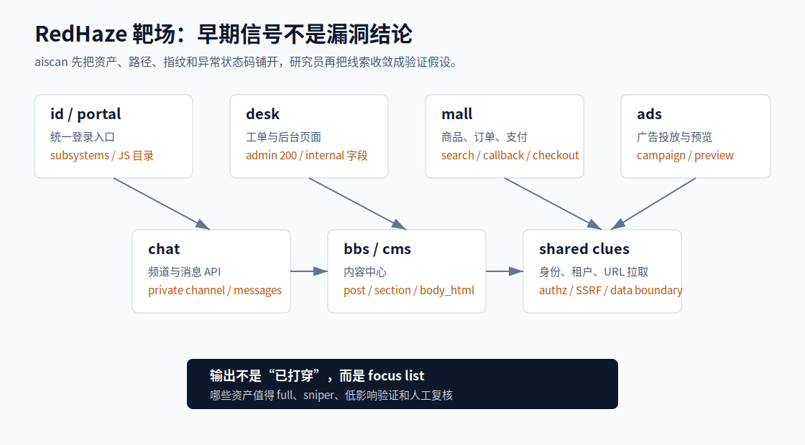
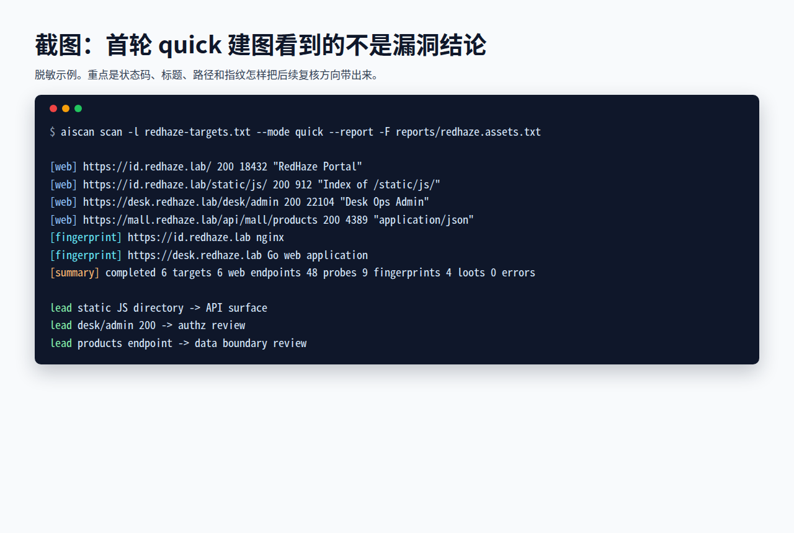
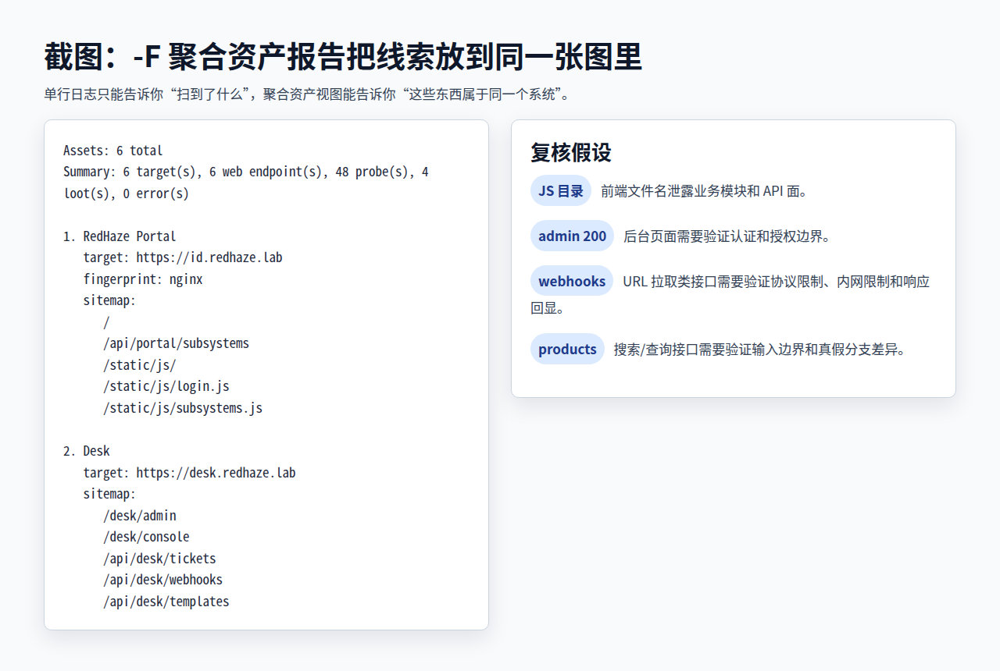
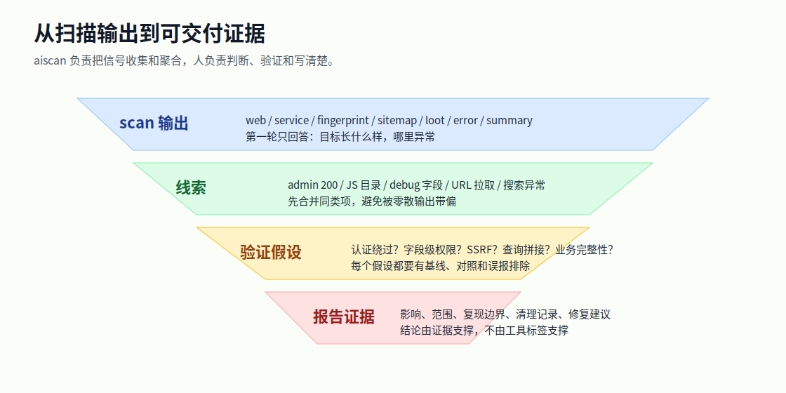
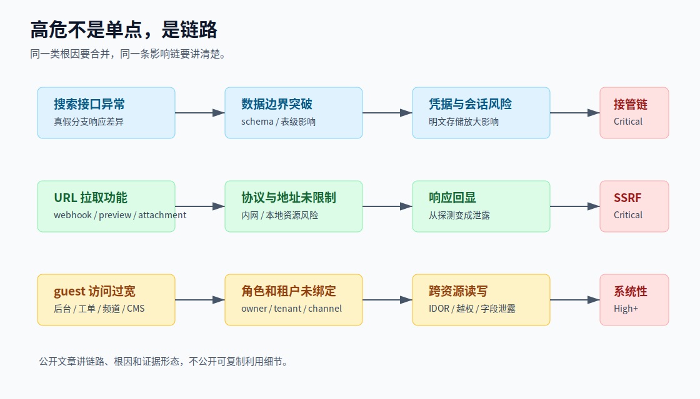
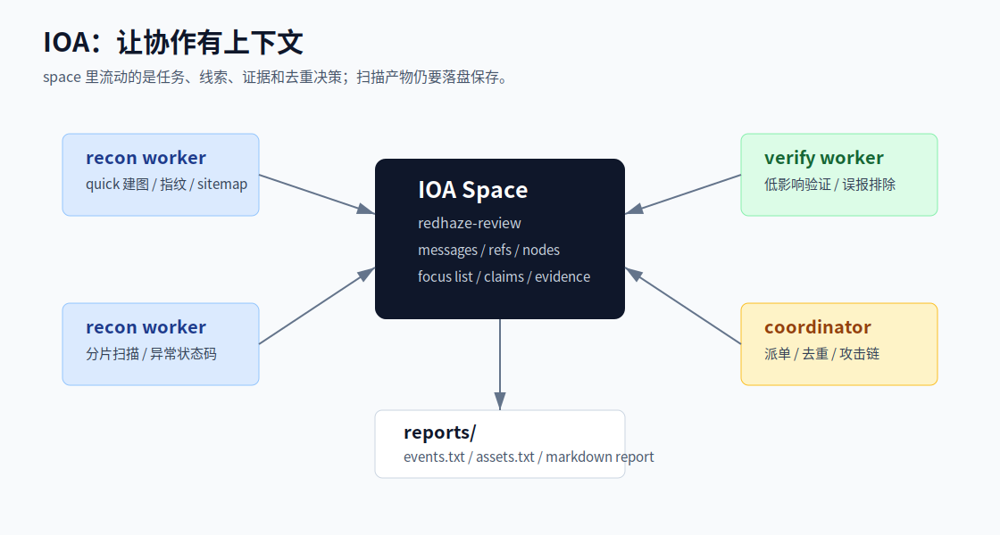
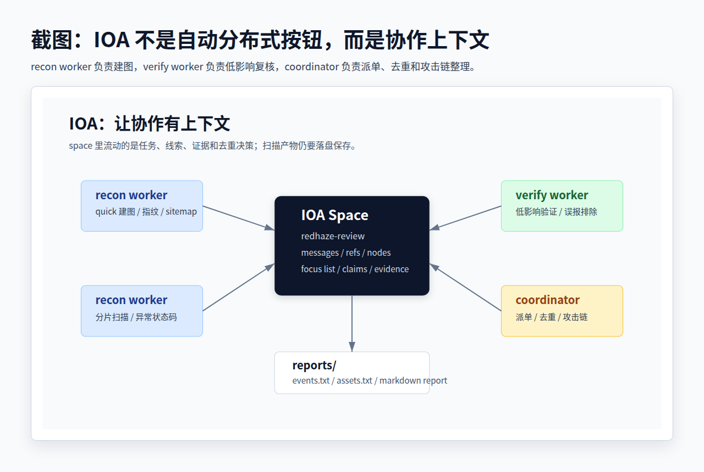

# 一次高危链路是怎么被 aiscan 带出来的

真正能交付的安全文章，不应该只是一串参数，也不应该写成“AI 自动发现漏洞”的广告词。

aiscan 在实战里的价值更朴素：它把资产、Web 入口、指纹、路径、异常响应、POC lead、报告素材和多人协作放到一条流水线上，让研究员更早看见危险信号。漏洞仍然需要人来判断、验证和写清楚，但人不必再从散乱的终端输出里手工拼图。

这篇文章用两个 case 来讲这件事：

- RedHaze 靶场：适合展示一次高危链路是怎么从资产图、JS、未授权页面、URL 拉取接口和搜索接口异常里长出来的。
- K3Cloud 授权测试：适合展示 ERP/RPC/.NET 类系统里，aiscan 如何先把“可疑接口 + 错误行为 + 版本边界”摆到台面上，再进入低影响验证。

文中所有命令和输出都做了脱敏和简化，不包含真实会话、口令、利用 payload、绕过细节或可直接复用的攻击请求。

---

## 先看图：case 不是从 RCE 开始的

RedHaze 这个靶场的最终报告里有 SQL 注入、SSRF、IDOR、XSS、明文密码和系统接管链路。但第一次扫描时，aiscan 看到的不是“系统接管”，而是一些看起来分散的信号：

- 一个统一身份入口。
- 几个业务子域：商城、工单、广告、聊天、内容中心。
- 静态 JS 目录可列目录，文件名泄露了业务模块。
- 某些后台页面在普通访客视角下返回 200。
- 工单、广告、附件、预览类接口里出现 URL 拉取功能。
- 搜索、支付回调、频道消息这类接口对输入和身份边界很松。

这些信号单独看都不够写成 Critical。串起来以后，才变成“值得继续挖”的方向。



这就是 aiscan 适合介入的位置：先把可见面铺开，再让研究员挑出最可能变成高危链路的入口。

---

## 第一轮：quick 建图，不急着深打

大多数 case 的第一轮都应该克制。先让 aiscan 做 quick 建图，保存聚合资产报告：

```bash
aiscan scan -l redhaze-targets.txt \
  --mode quick \
  --report \
  -F reports/redhaze.assets.txt \
  -f reports/redhaze.events.txt
```

从源码看，`quick` 并不是“只扫首页”。它包含端口发现、Web 探测/指纹、crawl depth 2、HTTP Basic 弱口令、通用弱口令目标和基于指纹的 POC 检查。`full` 在这个基础上增加 common/bak/active Web 插件探测和默认字典路径爆破，crawl depth 仍然是 2。

第一轮输出里，研究员先看这些字段：

| 输出 | 现场意义 |
| --- | --- |
| `[web]` | 哪些 Web 入口活着，状态码、标题、长度是否异常 |
| `[service]` | 非标准端口、IIS/.NET、Java 中间件、数据库、远程管理服务 |
| `[fingerprint]` | ERP、OA、身份、网关、报表、运维平台等高价值产品 |
| `[risk]` | 弱口令、Basic Auth、暴露控制台等需要授权复核的线索 |
| `[vuln]` | POC 模板命中，只能先当 lead，不能直接当 confirmed |
| `[summary]` | 本轮目标、Web、指纹、loot、错误数量，决定下一轮范围 |

一个脱敏后的输出片段大概是这样：

```text
$ aiscan scan -l redhaze-targets.txt --mode quick --report -F reports/redhaze.assets.txt

[web] https://id.redhaze.lab/ 200 18432 "RedHaze Portal"
[web] https://id.redhaze.lab/static/js/ 200 912 "Index of /static/js/"
[web] https://desk.redhaze.lab/desk/admin 200 22104 "Desk Ops Admin"
[web] https://mall.redhaze.lab/api/mall/products 200 4389 "application/json"
[fingerprint] https://id.redhaze.lab nginx
[fingerprint] https://desk.redhaze.lab Go web application
[summary] completed 6 targets 6 web endpoints 48 probes 9 fingerprints 4 loots 0 errors
```

脱敏后的终端截图如下。它表达的是发现路径，不是真实目标的复现凭据。



注意这里还没有“漏洞结论”。这只是地图。

真正有用的是 `-F` 写出的聚合资产报告。它会把同一个资产下的 service、fingerprint、loot 和 sitemap 放在一起，比单行日志更适合复盘：

```text
Assets: 6 total

1. RedHaze Portal
   target: https://id.redhaze.lab
   fingerprint: nginx
   sitemap:
      /
      /api/portal/subsystems
      /static/js/
      /static/js/login.js
      /static/js/subsystems.js

2. Desk
   target: https://desk.redhaze.lab
   sitemap:
      /desk/admin
      /desk/console
      /api/desk/tickets
      /api/desk/webhooks
      /api/desk/templates
```

聚合资产报告的截图更接近复盘时的工作台视角：同一个资产下的路径、指纹和异常线索被放在一起。



这份资产报告已经足够让人问出第一个关键问题：为什么静态目录能列目录？为什么普通视角能看到 admin/console？为什么前端 JS 里直接暴露这么多 API 面？

---

## 第二轮：从文件名和状态码开始收敛

RedHaze 的发现路径并不玄学，基本就是从几个早期线索往下追。

第一类线索是静态目录和 JS 文件名。`login.js`、`subsystems.js`、`desk.js`、`mall.js`、`ads-console.js` 这种名字，会直接告诉你系统有哪些业务面。此时不需要盲猜目录，先把前端已经引用的 API 面整理出来。

```bash
rg -n "api/|admin|console|callback|webhook|template|search|messages" reports/redhaze.assets.txt
```

第二类线索是状态码。`/desk/admin`、`/desk/console` 这类页面如果在无登录或低权限 cookie 下返回 200，就不能只记一条“目录发现”。它应该升级成认证/授权复核任务。

第三类线索是字段。工单详情、评论、模板渲染、频道消息这类接口如果回显 `internal`、`debug`、`note`、`tenant`、`role`、`owner` 相关字段，要立刻检查字段级权限和租户边界。

这一步的目标不是打穿系统，而是把“值得验证的假设”写出来：

| 线索 | 假设 |
| --- | --- |
| 静态 JS 目录可列目录 | 前端路由和 API 面可能被完整暴露 |
| 访客能访问后台页面 | HTML 页面和 API 可能没有复用同一套鉴权 |
| 工单返回 internal/debug 字段 | 字段级权限可能缺失 |
| URL 拉取类接口存在 | 需要验证 SSRF、协议限制、回显行为 |
| 搜索接口响应异常 | 需要验证查询拼接、报错、真假分支差异 |
| 支付回调/广告统计无明显认证 | 需要验证业务完整性和来源校验 |



这张图是 aiscan 的实际使用方式：不是输出一条 lead 就交报告，而是把 lead 变成假设、验证和证据。

---

## 第三个小时才有 Critical：高危链路是拼出来的

RedHaze 的高危结果可以拆成三条主线。

第一条是数据边界。商城搜索接口出现异常响应后，研究员先做低影响的真假分支对照，只确认“输入会改变查询逻辑”。在靶场授权范围内继续复核后，才确认可以读到 schema 和敏感表。再往后，明文凭据、会话记录和管理员登录只是这条链路的影响扩展。

第二条是 URL 拉取。工单 webhook、附件远程拉取、广告落地页预览都属于“服务端替用户请求一个 URL”的能力。只要协议限制、内网地址限制、响应回显和权限控制没做好，就很容易从普通功能变成 SSRF/LFI。验证时应该优先使用可控回连、健康检查或无敏感内容的探测目标，不应该上来读取敏感文件。

第三条是授权边界。Desk、Chat、CMS、Mall、Ads 里多处出现“guest 能做员工/管理员/供应商动作”的情况。单点看是 IDOR、越权、任意发帖、任意评论、任意频道读写；放在一起看，就是整套系统没有把身份、角色、租户和资源 owner 绑定到服务端查询里。



这也是为什么最终报告需要合并去重。Round 3 里很多发现不是新的独立漏洞，而是已有漏洞的补充证据或影响扩展：

| 新线索 | 更合理的归并方式 |
| --- | --- |
| 另一个接口也能触发 URL 拉取 | 并入 SSRF/LFI 家族，作为第二入口或补充证据 |
| 通过同一个 SQLi 读到更多表 | 并入 SQLi/数据库泄露影响面 |
| guest 又能读一个私有频道 | 并入 Chat 频道授权缺失 |
| 使用泄露凭据登录最高权限后台 | 作为 SQLi + 明文密码的攻击链结果 |

报告不是漏洞数量比赛。能把 69 条原始发现合并成 55 条独立漏洞，本身就是交付质量的一部分。

---

## K3Cloud case：最早的信号是什么

K3Cloud 授权测试的发现路径和 RedHaze 很像，只是目标类型不同。

一开始并不是“知道这里有反序列化 RCE”。更实际的路径是：

```text
aiscan 建图
  -> 识别 ERP / K3Cloud / IIS / .NET 指纹
  -> crawl 看到 WebService/RPC 风格接口
  -> 某类服务端点出现异常 500、组件名或堆栈线索
  -> 聚合报告把产品、接口、错误行为放到同一个资产下
  -> --sniper / 人工情报确认补丁边界和历史漏洞模式
  -> 低影响验证确认危险反序列化路径存在
  -> 写报告时保留证据，不公开 payload 和绕过细节
```

这个 case 里，aiscan 最关键的作用是把“ERP 指纹 + .NET/IIS 环境 + RPC 服务端点 + 异常错误”这几个本来分散的点聚在一起。它不会替研究员得出“已 RCE”的结论，但会把这个资产从普通 Web 提升成必须人工复核的高优先级目标。

对这类系统，建议先做聚合筛选：

```bash
aiscan scan -l erp-targets.txt \
  --mode quick \
  --report \
  -F reports/erp.assets.txt

rg -n "ERP|K3Cloud|IIS|\\.NET|WebService|RPC|Service|500|stack|version" reports/erp.assets.txt
```

筛出重点资产后再做 full 和情报关联：

```bash
aiscan scan -l erp-focus.txt \
  --mode full \
  --sniper \
  --max-neutron-per-finger 50 \
  --report \
  -F reports/erp-focus.assets.txt
```

这里的“抢占式”不是更激进地打 payload，而是更早把高风险资产排到队列前面。ERP、OA、身份、网关、报表、导入导出、RPC、插件和文件处理接口，都应该比普通营销页更早进入人工复核。

---

## 验证：用低影响证据替代炫技

很多高危漏洞的文章一写就变成复现教程，这对公开传播和客户修复都不友好。更好的写法是证明影响，但不教人复制。

验证时建议保留四类证据：

| 证据 | 说明 |
| --- | --- |
| 基线请求 | 正常请求的状态码、响应长度、标题或业务字段 |
| 对照请求 | 低影响变体带来的稳定差异 |
| 误报排除 | 排除 WAF、CDN、登录跳转、缓存、网络抖动 |
| 影响证明 | 权限边界、字段泄露、受控回连、时间差异或最小化写入 |

对于反序列化、SSRF、SQLi 这类高危问题，报告里可以写验证思路和证据形态，但不要公开完整 payload、真实敏感路径、会话 cookie、口令、主机名、测试文件名或可直接复制的命令。

`--verify=high` 可以帮助复核 high/critical lead：

```bash
aiscan scan -l verify-targets.txt \
  --mode full \
  --verify=high \
  --report \
  -F reports/verify.assets.txt
```

但最终报告不要写“AI 确认”。应该写“基线响应是什么、对照响应是什么、为什么这说明权限或输入边界被突破、业务影响是什么、哪些数据没有访问、测试后清理了什么”。

---

## 集群化：先分片，再聚焦

大范围 SRC 或企业资产盘点里，不建议一开始全量 full。更稳的做法是三轮：

第一轮，分片 quick 建图：

```bash
split -l 200 targets.txt targets.part.

aiscan scan -l targets.part.aa --mode quick --timeout 5 \
  -F reports/aa.assets.txt -f reports/aa.events.txt

aiscan scan -l targets.part.ab --mode quick --timeout 5 \
  -F reports/ab.assets.txt -f reports/ab.events.txt
```

第二轮，从资产报告里挑 focus：

```bash
rg -n "ERP|OA|SSO|VPN|admin|console|debug|callback|webhook|template|upload|search" reports/*.assets.txt \
  > reports/focus-candidates.txt
```

第三轮，只对重点资产 full：

```bash
aiscan scan -l focus.txt \
  --mode full \
  --sniper \
  --max-neutron-per-finger 50 \
  --report \
  -F reports/focus.assets.txt
```

这种方式看起来慢一点，但生产影响更可控，复核质量也更高。真正省时间的是少扫无意义目标，而不是把所有参数开满。

---

## IOA：让多人复核有上下文

IOA 不是“自动分布式扫描按钮”，更像一个轻量协作空间。多个 agent worker 加入同一个 space，通过消息交换任务、线索和结果。



同一套 IOA 分工也可以用截图放进文章，方便读者一眼看出 recon、verify 和 coordinator 的边界。



启动 IOA server：

```bash
aiscan ioa serve --ioa-url http://127.0.0.1:8765
```

启动一个建图 worker：

```bash
aiscan agent --loop \
  --ioa-url http://127.0.0.1:8765 \
  --space redhaze-review \
  --ioa-node-name recon-1 \
  -s aiscan -s scan \
  -p "负责 quick 建图。只汇报资产、指纹、异常状态码和高价值接口，不做破坏性验证。"
```

启动一个复核 worker：

```bash
aiscan agent --loop \
  --ioa-url http://127.0.0.1:8765 \
  --space redhaze-review \
  --ioa-node-name verify-1 \
  -s aiscan -s scan -s report \
  -p "负责 high/critical lead 的低影响复核。输出基线、对照、证据、误报排除和修复建议。"
```

启动一个协调者：

```bash
aiscan agent --loop \
  --ioa-url http://127.0.0.1:8765 \
  --space redhaze-review \
  --ioa-node-name coordinator \
  --heartbeat 5 \
  -s aiscan -s ioa \
  -p "只做协调：读取 IOA 消息、分配分片、合并重复发现、维护 focus 列表。"
```

当前 CLI 路径下，`aiscan ioa serve` 使用默认内存 store。需要归档时，仍然要保存每个 worker 的 `-f`、`-F` 和 `--report` 输出，不要只依赖 IOA space。

---

## 一篇能给人看的报告应该怎么落笔

不要这样写：

```text
aiscan 发现目标存在严重漏洞，可 RCE，危害极大，建议修复。
```

这句话没有发现路径，没有证据，没有误报排除，也没有修复优先级。

更可交付的写法应该像这样：

```text
第一轮 quick 建图显示目标为 ERP 类系统，Web 服务运行在 IIS/.NET 环境；
聚合资产报告中出现 RPC/WebService 风格端点，并在低影响请求下返回服务端组件错误。
随后通过 full + sniper 复核补丁边界，确认该版本落在修复版本之前。
在授权范围内使用低影响方法验证危险反序列化路径存在，未读取业务数据，未部署持久化文件。
建议立即升级到厂商修复版本，临时限制相关服务端点公网访问，关闭详细错误回显，并检查异常调用日志。
```

对 RedHaze 这类靶场，文章可以写“从目录列表和 JS 文件名发现 API 面，从 guest 可访问后台发现授权边界，从 URL 拉取接口发现 SSRF 风险，从搜索接口响应差异发现数据边界问题”。这比直接贴 50 个 PoC 更像一篇文章，也更能说明 aiscan 解决了什么问题。

---

## 最后的实践清单

日常使用可以固定成这套节奏：

| 阶段 | 目标 | 推荐做法 |
| --- | --- | --- |
| 建图 | 看清资产和入口 | `quick` + `-F` + `--report` |
| 筛选 | 把高价值资产排前面 | 关注 ERP/OA/SSO/VPN/运维/报表/RPC/上传/回调 |
| 聚焦 | 对重点资产加深 | `full` + `--sniper` + 合理的 POC 上限 |
| 复核 | 降低误报 | 基线、对照、低影响验证、误报排除 |
| 协作 | 多人/多 agent 分工 | IOA space + recon/verify/coordinator worker |
| 交付 | 推动修复 | 合并去重、攻击链、影响、清理记录、修复优先级 |

---

## aiscan 功能全景：文章里用到了哪些，哪些没展开

这篇文章不是完整命令手册。完整参数和子命令说明应该看 `docs/usage.md`。这里补一张功能全景，是为了让读者知道 aiscan 的能力边界，也知道为什么本文只重点展开 scan、抢占式验证、分片和 IOA。

| 功能 | 作用 | 这篇文章里的位置 |
| --- | --- | --- |
| `scan` | 自动扫描流水线，串联端口发现、Web 探测、指纹、弱口令和 POC lead | 主线功能，用 RedHaze/K3Cloud case 重点展开 |
| `quick/full` | 控制扫描画像。`quick` 适合首轮建图，`full` 增加 common/bak/active 插件和默认字典路径探测 | 用于“先建图、再聚焦”的节奏 |
| `-F/--format` | 聚合资产报告，把 service、fingerprint、loot、sitemap 放到同一资产下 | 文章截图和复盘方法重点展示 |
| `--report/-f/-j` | 分别输出 Markdown 报告、事件文件、raw JSON Lines | 文章只展开 `--report`、`-F`、`-f`，没有展开 `-j` 脚本处理 |
| `--verify` | 用 AI 对 high/critical lead 做辅助复核 | 作为低影响验证的辅助，不作为最终结论来源 |
| `--sniper` | 根据明确指纹检索公开漏洞、补丁边界和情报 | 用于 K3Cloud/ERP 这类“先有指纹再查边界”的场景 |
| `--deep` | 对发现的站点做更深入的动态 AI 测试 | 本文只点到，没有在 case 里展开，避免文章变成深测手册 |
| `gogo` | 单独做主机、端口、服务、banner 和指纹发现 | 被 `scan` 间接使用；单独命令见使用文档 |
| `spray` | 单独做 Web 探测、HTTP 指纹、常见路径、爬取 | 被 `scan` 间接使用；RedHaze 的 JS/路径发现属于这个方向 |
| `zombie` | 授权弱口令检测 | 被 `scan` 间接使用；本文没有展开弱口令 case |
| `neutron` | 模板化 POC 检测 | 被 `scan` 间接使用；本文强调 POC 命中只能当 lead |
| `agent` | 自然语言任务代理，可进入交互式模式，也可作为 IOA worker | IOA 段落里展开了 `agent --loop` 的协作方式 |
| scanner `--ai` | 对单个 scanner 输出交给 LLM 分析 | 本文没有展开；它更适合命令手册，不适合放进 case 主线 |
| `ioa serve/spaces/messages/context/nodes` | IOA 协作层，提供 space、node、message 上下文 | 本文重点讲了 `ioa serve` 和多 worker 分工 |
| `cyberhub` | 查询/扩展指纹和 POC 资源 | 本文没有展开；适合放配置和资源服务文档 |
| `katana` | full 版 Web 爬虫 | 本文没有展开；适合讲大型 Web 面爬取时单独说明 |
| `passive` | full 版网络空间搜索，FOFA/Hunter 方向 | 本文没有展开；适合资产收集专题 |
| `playwright` | full 版浏览器自动化/截图/动态页面检查 | 本文的截图是文档截图，不是用它展开目标站测试 |
| `proxy` | 扫描代理支持，含普通代理和订阅类代理配置 | 本文没有展开；适合配置文档 |
| `tmux/bash/read/write/glob/fetch/web_search` | agent 可用的辅助工具和终端能力 | 本文只讲协作角色，不讲 agent 工具箱细节 |

所以，文章对 aiscan 的介绍是“实战主线覆盖”，不是“所有功能逐条讲完”。如果目标是官网/README 的产品介绍，可以把上表再压缩成一张能力总览图；如果目标是用户手册，继续放在 `docs/usage.md` 更合适。

aiscan 不是替代研究员的结论机器。它更像一个把线索提前摆好的工作台：让你更快发现哪里值得看，更稳地验证哪里真的有问题，也更容易把一个 case 写成能给人看的文章。
