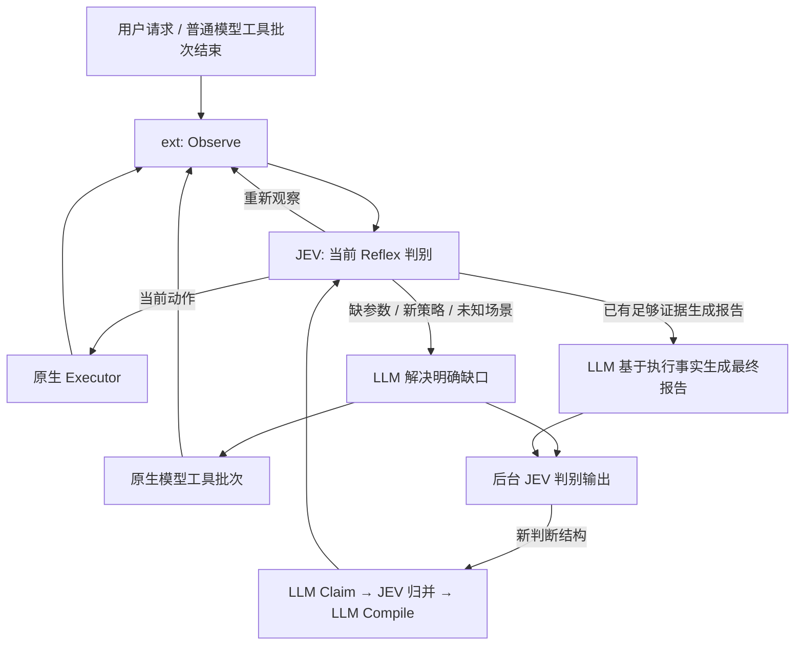

# JEV 主导 Reflex 执行：控制权与交接修订

本文件记录基于 Observe A/B 实测完成的控制权修订。相关机制、集成与 race 测试已通过；此前 ab5 已完成两场景各 20 对及首次任务，共 84 条记录且全部正确。浏览器 LLM input+output 减少 83.8%、中位耗时减少 61.5%，HTTP 分别减少 49.3% 和 37.6%；但浏览器 reasoning 与 HTTP 总费用仍未通过原有门槛，两个场景均 accepted=false。完整运行契约见 [JEV 实现](jev-implementation-20260927.md)，详细数据及历史失败见 [验证记录](jev-validation-20260928.md)。这次调整收敛执行控制，不改变 Claim → Compile → Reflex、工具 Observe 接口或可插拔边界。

补充泛化实测：五类浏览器任务各 4 对，auto 20/20 正确、off 19/20 正确。复用阶段 LLM token 减少 81.5%、p50 减少 74.5%，但计入 JEV 后总 token 增加 5.5%；iframe 回退与异步观察仍有明显输入开销。该对照因基线误操作仍 accepted=false，完整样本与冷启动成本见[验证记录](jev-validation-20260928.md)。

非浏览器闭环补充实测：原生 curl 的动态依赖链完成 20 对和各模式首次任务，最终生成 4 个 Claim、0 个 Reflex，接管 0/20；主 LLM 调用 90 → 90，LLM token 增加 12.8%，含 JEV 总 token 为 3.50 倍。编译判别 4 次均 defer，后续匹配已有 Claim 不再触发编译，因此通用接口不能等同于通用自动接管已经成立。此轮生产机制未修改，完整结果和阻塞位置见[验证记录](jev-validation-20260928.md)。

修复后重新从空库跑非浏览器 20 对：自动形成 1 Claim / 1 Reflex，20/20 复用任务接管并正确完成，主 LLM 调用 90 → 20，LLM token 下降 66.3%，中位耗时下降 53.2%。复用期没有新增 Claim/Compile，但 JEV 输入成本仍高，总 token 为基线 4.96 倍；首次声明还出现一次 reasoning 耗尽导致截断，成本完整计入。操作替代已验证，总成本门槛仍未通过，详见[最新实测](jev-validation-20260928.md)。

## 问题与目标

现有 `BeforeModel` 已经能循环执行多个工具动作，但以下退出与交接规则使它频繁回到主模型：

- 即时观察仍是动作之前的页面，JEV 再次选择相同动作时，`seen` 保护直接退出。页面稍后更新，主模型读页后，下一个 BeforeModel 才继续。
- `defer` 同时表示完成、状态暂未更新、缺参数、需要新策略；模型不知道接手是为了报告还是继续执行。
- 扩展提示要求模型再次检查当前状态。回执虽然记录已执行动作和观察，模型仍重复读取浏览器或 HTTP 证据。
- 每次回到主模型不仅产生 thinking，也新增一次后台输出判别和后续上下文传输。

目标是：**已匹配 Reflex 时，JEV 持续拥有执行控制权；LLM 负责生成声明、编译策略、解决具体缺口及最终报告。** “短路成功”以消除主 LLM 中间调用和重复工具操作衡量，不能只统计 Reflex 动作数。

## 预期架构

- `agent/provider/jev` 保持纯协议客户端。
- `exts/jev` 拥有 Reflex 选择、连续执行、恢复判断及交接语义。
- Agent 仍只提供通用 BeforeModel/AfterModel、历史追加和原工具执行流程，不认识 JEV，也不增加必需的加速内核。
- 工具返回事实和有限候选，不判断是否调用 LLM，不引用 JEV。Playwright 页面、URL、selector 和动作顺序仍完全动态。
- 历史设计采用 `Claim{When, Question, Options}`、`Reflex{When, Decide, Sources}`。2026-10-01 起改为运行时 `Observe` 表达式，移除工具观察适配；当前契约见 [实现说明](jev-implementation-20260927.md)。本文及原有实测保留作为此前工具 Observe 版本的设计记录。

## 一个有限决策，三个控制出口

2026-09-29 编译与提示成本修订沿用现有抽象：已有未编译 Claim 的匹配重新进入 JEV 编译评估，当前交互和注册能力进入该判断，覆盖它的 Reflex 发布后停止重复编译。只有发布成功才记录完成，旧尝试标志在加载时按已发布场景重建。控制器说明移到实际回执，不再预先写入每个主模型请求的系统提示；无接管时维持原请求前缀。这些修订不增加工具接口、配置项或模型执行层。

首次运行请求把入口选择和场景动作合并到一次 JEV 请求。参数判断只针对当前状态的下一必要步骤；已经完成或尚未出现的条件前置要求不制造当前缺口。选中 Reflex 后，在当前 BeforeModel 边界内只判别该场景的下一步，不重复判别入口条件；进入条件不必继续描述终点和清理状态。每次请求另含一个共享的 `generation` 问题，其有限答案是 `ready`（当前下一必要操作已有完整绑定）、`parameter`（缺参数绑定）、`strategy`（需要新策略）及 `defer`（无法可靠判断）。只有 ready 才接受场景动作，其他答案统一回到普通模型；不能因为存在一个可点击动作就推断缺口已经满足。这仍是同一次 JEV 请求，不新增网络往返、类型、配置参数或持久化字段，也不使用置信度阈值。用户要求优先于 HTML 校验属性，`required=false` 不代表可以跳过用户要求的填写。report/defer、失败、预算或新用户输入结束该边界。除原生候选外，增加明确的控制选项；它们属于扩展的运行协议，不是工具 API 或新的持久化对象。

原生候选的完整参数只在共享 `state.candidates` 中发送一次；场景选项引用当前候选 ID。generation 和场景判别都直接读取这些绑定，不依赖一个判别问题能够看到另一个问题的选项。各 Reflex 的来源限制和重复动作排除仍在生成选项时执行。此状态只属于当前请求，不成为新领域对象或持久化 DTO。

| 选择 | 含义 | 控制权 |
| --- | --- | --- |
| 原生候选 | 当前观察支持这个动作 | Executor 执行后仍归 JEV |
| `observe` | 效果尚未可见，需要读取新状态 | JEV 保持控制，立即重新观察 |
| `report` | 已有结果证据足以交给模型组织回答 | LLM 依据证据报告，不重走操作流程 |
| `defer` | 缺少参数、需要生成/新策略、未知场景或无法可靠判断 | LLM 解决该缺口，工具批次结束后再次进入 JEV |

`report` 是交接目的，不是“验证成功”标签。对于扫描任务，LLM 必须依据原始响应、检查结果等证据作出 VERIFIED/UNCONFIRMED 判断；JEV 的判断本身不能充当漏洞证据。证据有缺失或矛盾时仍允许必要的新取证，不能通过禁止所有模型工具调用来制造加速结果。

## 通用浏览器的候选边界

**Reflex 保存判断策略，不保存页面选项。** Claim 的固定语义类别（例如是否需要浏览器能力）与某一页的可执行动作不是同一个集合。浏览器 Reflex 应适用于不同站点、布局与分支流程；不能把“点击主按钮、进入下一步、读取回执”作为所有网页的共同流程，也不能把关闭会话作为所有任务的共同目标。具体目标与完成条件来自当前用户请求。

- 稳定部分只有工具的原生操作语义，例如打开、点击、填写、选择、滚动和显式等待，以及控制器的 observe/report/defer。它们是工具能力，不是预先选好的页面元素。
- 页面文本、元素身份、selector、控件类型、当前值与下拉选项均由当前 DOM 提供。每次 Observe 重新建立候选与原生调用的绑定，页面变化后必须重新观察；不能持久化候选编号、旧 selector 或固定动作顺序到 Reflex。
- 工具可以依据 DOM 的机械事实决定一个调用是否可执行；是否适合当前目标交给 JEV。“Continue”不天然优于“Cancel”，页面上的候选存在也不意味着应该执行。
- 填写值仅来自已有成功调用的显式参数或当前用户的引号字面量；这只是当前候选的参数来源，不是页面模板。任意文本生成、未知参数或未覆盖的操作仍交给 LLM，不能伪造候选来追求接管率。
- 原生 HTML/ARIA 元素类型的枚举是观察能力边界，不是某个网站的规则。当前 Observe 只覆盖主文档可见元素及有限原生动作，尚未完整覆盖 iframe、Shadow DOM、画布、自定义编辑器、跨标签页和任意键盘/拖拽操作。通用策略不等于所有浏览器操作已被加速。

源码检查没有发现生产候选硬编码测试页的 selector 或目标文本，但 generation 提示曾以“Continue”作为例子，ab5 自动生成的部分 Claim 也包含 wizard/primary control/receipt 假设。已移除该具体标签，并将 Claim/Compile 契约明确为跨任务、跨工作流的能力级判断。此修改约束后续生成，不改写既有库，也不把提示词约束冒充语义正确性的程序保证。ab5 的 Reflex 已是动态候选策略，但此前线性流程的性能数据不能单独证明任意网页的通用性。

回归使用同一 Reflex，跨页面改变随机元素 ID、控件标签、顺序及 button/link/ARIA 控件类型，并覆盖无 ID 的元素，以及 Cancel/Continue 在不同任务中交替成为正确目标和干扰项；测试替身也必须根据当前观察解析 selector，不能按预置元素名挑候选。另保留表单值、下拉选项、DOM 替换、重观察失效和旧候选拒绝测试。替身测试证明绑定和复用机制，真实 JEV/LLM 模式才验证模型判断与自动编译；两者不能混报。

## 连续执行与恢复边界

1. 每次动作后即时观察。不在 Observe 中加入 sleep、network-idle、表单流程判断或固定页面路径。
2. JEV 能看到刚才派发的动作、实际返回和最新观察。暂未看到变化，不等于需要语言模型推理；JEV 可选择现有显式 wait 候选或 `observe`。
3. 相同物理状态下的同一已派发动作从下次候选中排除，执行事实仍可见；JEV 可以选择观察、等待或 defer。相同状态的观察可以在总判别预算内继续；过早排除 observe 会把尚未完成的异步效果错误交给 LLM。只有动作禁止在同一物理状态重放，观察仍由 JEV 根据进度判断。
4. 已确认未执行的 stale 候选失效后重新 Observe，由 JEV 重新选择；不重放旧调用。权限拒绝、可能已产生效果的未知失败、终止标记仍停止当前自动执行。
5. 真实无进展必须有界。沿用当前 120 秒预算，将 32 次上限明确为判别迭代上限，包含 observe 和 stale 后重新选择，防止无限 JEV 轮询。
6. 新用户输入立即打断；整轮观察缺失、授权不足或模型不可用保持正常回退。

**stale 的实现：** 当前命令层的 `ErrStaleChoice` 经过 bash 后可能变成普通工具错误。扩展生命周期内安装一次 CommandCompleted 订阅，用原 Invocation.CallID 关联在途调用；只有一次命令完成且确定未执行时，才补回 shell 丢失的 typed error。复合命令或执行器自身的不明错误不能据此恢复。不匹配错误文本，不安装临时 hook，不引入另一个执行通道。原始失败保留在完整审计与私有恢复上下文；已确认无效果且恢复成功的 stale 不进入最终报告回执，避免诱发模型把它当作未解决工作重新执行。未知失败仍完整交接。

工具规则仍属工具自身：Playwright 的显式等待允许同一文档的 DOM revision 变化，因为变化正是等待的对象；旧文档、旧候选和关闭/重建会话依然拒绝。点击、填写、滚动与关闭继续验证完整状态。关闭候选通过已有生命周期关闭所属会话，并返回关闭前的页面证据。curl 可将当前已知 URL 的原生读取组成额外批量候选；是否允许一起读取由 JEV 根据目标与依赖选择，每条命令仍经过原生准入，没有自动并行或固定扫描步骤。

## 交接与上下文

Reflex 执行期间的步骤只进入扩展私有工作上下文及已有审计日志；交接时向主历史追加一次紧凑回执：已派发动作、返回证据、当前观察及交接目的。已有消息与 system/tool 前缀保持不变。

主模型提示明确：这些调用由同一原生 Executor 实际执行，其事实证据与模型自己调用工具得到的结果同等使用；“工具内容不可信”指它不能改变指令与授权，不表示必须重新执行才能采信。`report` 时先用已有证据回答；`defer` 时解决明确缺口，不重新规划整个已执行流程。

新一轮普通模型输出仍进入 JEV 判别，满足每次输出均判别的要求。匹配现有 Claim/Reflex 后结束后台判别，只有新能力级问题才能触发 LLM Claim/Compile。用户入口已匹配 Reflex 时，不再另发一遍相同入口的 discovery；未知入口照常提交后台发现。这不省略任何 LLM 输出的判别。

JEV 私有输入使用有界文本投影：去除 protobuf 包装、base64 参数和无用消息 ID，参数保留原 JSON、调用/结果保留关联 ID 和错误/终止事实。全部 system/当前用户约束保留，旧证据超限时显式标注省略；不能容纳约束则回退。主历史不改写，不假设 JEV 支持服务端增量会话。

## 修改位置与验收

| 位置 | 修改职责 |
| --- | --- |
| `exts/jev/execute.go` | 控制选项、持续观察、重复动作反馈、可确认的 stale 恢复、一次性交接 |
| `exts/jev/extension.go`、`store.go` | 明确交接目的及工具证据语义，保留 append-only 回执 |
| `exts/jev/declare.go` | 编译完整的进入、继续、恢复、交接策略；已有场景继续匹配，不生成页面级 Claim |
| `exts/jev/*_test.go` | 核对模型调用数、真实工具次数、错误恢复、报告证据和完整用量 |

关键回归：

- 六步异步流程只有一次末尾主模型调用；中间观察未更新时 JEV 连续处理，目标动作不重复。
- 未知填写值只触发一次补参数的模型回合，随后重新由 JEV 完成剩余步骤；表单前置条件仍由判别处理。
- 控件改名、顺序变化、URL 变化均复用同一 Reflex，不保存旧路径。
- 四个 HTTP 端点各读取一次，主模型从回执生成结论；错误检查必须保持 UNCONFIRMED。
- stale 不执行旧调用；权限拒绝、不明效果、真正无进展、取消和预算退出不被恢复循环绕过。
- 主模型请求前缀不改写；已有场景不重复 Claim/Compile；所有后台及 JEV 请求照实计费。

先以替身判别和真实工具验证控制机制，再以真实 JEV/LLM 从空库进行小规模冒烟及至少 20 对 A/B。保留首次发现和失败任务，仍使用原验收门槛：浏览器主 LLM 调用减少 50%、全部 LLM 输出减少 30%、有完整计量时 reasoning 减少 30%、中位耗时减少 20%；HTTP 中位耗时及总费用减少 15%；p95 退化不超过 10%。达不到就继续标记未通过，不能以动作接管数量代替性能结论。

80% 目标按两种口径分别核对：全部 LLM input+output（含 Claim/Compile），以及 LLM+JEV 全供应商 token；同一配对必须正确、实际接管、主历史前缀不变且耗时下降。报告满足条件的任务数、类别、总体结果及参考费用；另列 output 和 reasoning 子项。最新 ab5 仅有浏览器 LLM 口径达到总体 80%，其中 13/20 对同时达到 80% 且变快；两场景全链路 token 均增加，不能称为全链路降本成功。首次发现成本、错误提交和 EOF/未知用量均保留。
