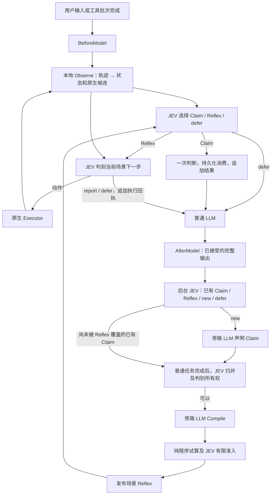

# JEV 可插拔旁路：Claim → Compile → Reflex

本文件是当前实现契约，替代原稿中的学习、训练、历史重放和激活流程。2026-10-01 修订将工具内置的 Observe 改为运行时生成的通用表达式。[研究稿](jev-harness-design-20260926.md) 和 [验证记录](jev-validation-20260928.md) 保留历史推导及旧实现的实测数据；样本数量不是启用门槛，旧版工具 Observe 的性能结果不能作为本修订的验收。

## 核心抽象

LLM 创造判断结构，JEV 在有限空间中判别。扩展只有两个领域类型：

```go
type Claim struct {
    When     string
    Question string
    Options  map[string]string
}
type Reflex struct {
    When    string
    Decide  string
    Observe string // 运行时生成的纯 JavaScript 程序，以 js: 开头
}
```

Claim 声明一次有限问题，例如“当前请求适合浏览器、HTTP，还是交回模型”。它没有 Chose、正确标签、示范动作或训练样本。声明只允许在来源任务及原用户约束仍有效时消费一次，包括 defer；完成任务之后生成的声明仅保留为编译材料。相同问题再次出现时，JEV 匹配已有声明，不重新创建或消费它。

Reflex 是可复用场景。When 定义入口，Decide 定义选择和退出准则，Observe 从当前用户交互、工具定义和实际执行结果中提取状态，动态绑定有限原生调用。工具语法和结果解析规则可以保存在运行时场景中，具体 URL、资源 ID、selector、版本和当前进度由实际数据产生；不要求工具实现任何 JEV 接口。

Compile 使用当前 LLM 旁路生成。JEV 从当前交互、相关 Claim、原生工具定义及普通文档判断能否形成有限场景；一个或多个 Claim 均可编译，数量不是启用门槛。LLM 只生成原始 `js:` Observe 程序或 `null`，When/Decide 复用已分组 Claim 的适用性、问题及有限语义类别，不重复生成语义。持久化仍是上述三个字段；编译响应不接受 JSON 场景或元信息加代码格式。

Claim 最多两份草稿，Observe 的格式错误、程序错误及复审拒绝共享最多三个草稿的纠正预算；接口故障直接回退。代码生成输入是声明的适用性/问题、既有 Observe 源码及一份归一化实际证据，不再混入 Claim.Options 或重复的执行策略，避免将语义选项误作原生绑定。完整原始消息保留在实际交互及日志。试算入口及实际轨迹边界，校验无关措辞、明确不要求执行的引用示例，以及复制任务 URL/路径的情况。JEV 在同一个请求中复审整体程序及各实际边界的下一步覆盖：已知必要效果不能被反复原始读取替代；能够生成效果绑定的结构化读取器是有效准备。拒绝后提供具体边界或有限缺陷诊断。允许真正缺少依据的部分读取场景交接，不允许遗漏已经由轨迹和文档证实的操作。模型复审及有限检查不证明所有分支正确。

后台不执行生成候选。一个连贯工作流声明一个能力级问题，获取句柄、定位、操作及读取是内部步骤。交互中由 JEV 直接匹配并声明，普通任务最终回答之后才编译或修复，用完整实际轨迹避免发布未完成批次；最终 Claim 焦点恢复为最近一次已完成原生调用。When 按用户请求识别能力，当前句柄和参数在运行时检查。后续每步本地生成候选，JEV 判别，普通 Executor 执行，不逐步调用 LLM 生成选项。实际补充证据可自动修正缺失的绑定。

编译前按实际轨迹和文档判别 whole/partial 所有权；whole 必须实现入口、已知操作及结果读取，不能发布只有入口和反复原始读取的草稿。试算后由 JEV 作有限准入与实际边界覆盖判别；拒绝的源码不发布。模型审核仍可能误判，不能替代真实执行验收。重复出现的原生候选调用只传一份，边界通过引用共享；每个实际结果及下一调用保留，不重复附上整份轨迹。没有额外普通 LLM 审核阶段。

已记录交接缺口并取得普通 LLM 的实际补充时，在同一次归并请求中由 JEV 判断是否需要修复，比较补充前的缺口与后续实际调用。它不再以“同一能力已有场景”抑制必要修复；冗余核实或仅缺运行时输入可直接 defer，不调用 LLM 生成。获准之后有界生成，null 可保留原场景，候选程序仍须通过纯试算及 JEV 有限准入。

上述三个 JSON 字段就是场景定义。Observe 统一在进程内 Goja 执行纯 JavaScript；每次新建运行时，只有 JSON 数据及纯函数，没有 Executor、文件、网络、计时器、随机数、日期或持久 VM 状态。不增加工具注册表、第二套执行器或编译 CLI。后台判别直接提供已有 Claim 和 Reflex，由 JEV 匹配能力级场景；参数及状态变化不应产生任务级声明。运行时仍需校验和交接。

场景库当前版本为 3。启动时先完整备份 v1/v2 库为同目录的 `library-v<version>-*.json`，保留全部 Claim、消费状态和当前 JavaScript 场景，退出运行旧工具观察器及 Expr 场景，再原子替换 `library.json`。保留的 Claim 可在后续正常交互中重新编译，不重放旧动作；没有 Claim 的旧场景仍保存在备份中供人工转换。当前版本不接受 Expr，重复启动不重复迁移。备份或替换失败会停止加载并保留原库。

`core/tool.Command`、CommandRegistry、curl 和 Playwright 已移除观察回调及 JEV 专属候选执行分支。宿主只需已有 `Executor.ToolDefinitions / ExecuteTool`；CommandExecutor 仅可选提供普通命令文档和 `jev status`。纯原生工具、没有命令注册表的宿主同样能安装加速 hooks。持久化格式为 version 2；读取 version 1 时保留 Claim 和消费状态，丢弃缺少运行时 Observe 的旧工具场景并清除对应编译记录，等待普通交互重新编译，不重放历史动作。

## 架构与数据流



- `agent/provider/jev` 只实现原生协议、重试、用量；不认识 Claim/Reflex。429/529、响应头前 EOF 与响应体截断共用最多三次尝试、250/500 ms 退避及原总超时预算；重试只重新请求判别，失败尝试的缺失用量仍记为未知，不重放工具。
- JEV 标准 HTTP transport 为 provider 自己的副本，限定 HTTP/1.1，并同步 TLS ALPN、保留连接复用及原代理/TLS 设置，避免实测 HTTP/2 推理请求长时间无响应。不会修改全局 transport、其他模型请求或进程 GODEBUG；宿主注入的自定义 RoundTripper 继续保留。
- Agent 的 `BeforeModel` 返回追加的原生观察消息；`AfterModel` 在接受完整模型输出后、执行其工具调用前触发一次。二者都在请求重试之外，提供历史副本；最终回答也进入 AfterModel。
- `exts/jev` 独占声明、编译、持久化、候选判别及执行循环。AfterModel 只提交快照，网络工作在单个有界后台队列进行。旁路调用直接使用现有 Provider，不运行 Agent，所以不递归触发 hooks。
- 未匹配 Reflex 的新用户约束边界提交一次后台 Claim/Reflex 判别，使首次浏览器请求能产生能力选择 Claim；已匹配场景的入口不重复判别。普通 LLM 不等待声明或编译。Reflex 发布后只能在后续安全边界接管；每次 LLM 输出仍进入 AfterModel 判别。
- LLM 一次输出中的文本和多个 toolcall 分别作为判别问题，合并成一次 JEV 请求。无需将 LLM 参数与历史候选精确匹配。
- 任务完成时，新声明及匹配到的未编译声明进入归并和可编译性判断；同任务已声明但最后一次判别未匹配的材料仍可参与。匹配已有 Claim 不重新生成或消费该 Claim。修复仅针对实际交接快照中存在的场景，匹配其支持 Claim 也可触发核对；同任务刚发布的场景不被误算作先前接管失败。当前交互、工具定义及普通命令文档支持任意已注册原生工具和多工具组合。是否编译由 JEV 决定，没有强制通过、计数门槛或无限重试。
- 编译去重记录仅代表已经持久化的 Reflex。生成失败、无效结果和 null 不永久标记完成；后续普通交互可以再次触发判别。加载旧库时从已发布 Reflex 的支持声明重建完成记录，清除旧实现中仅尝试过生成的遗留标记。后台流程不执行用户工具。
- 轮前将入口问题、Reflex 的候选选择及未消费 Claim 的判别放在一个原生 JEV 请求中，共享状态。只执行入口选中的分支；未选中分支不授权任何动作。
- 已选 Reflex 在当前 BeforeModel 边界持续拥有控制权，后续请求仅判别其下一步；入口 When 不再被用作终点状态的持续条件。只有 `report` 和 `defer` 两个控制项：前者表示已有足够证据组织回答，后者表示缺参数、缺策略或未知效果。需要刷新外部状态时选择普通读取候选，取得实际工具结果后再计算 Observe。
- 每次场景请求同时判别共享的 `generation` 问题，以 ready / parameter / strategy / defer 区分已绑定、缺参数、缺策略和无法可靠判断；只有 ready 才接受场景动作。用户要求的填写即使 HTML 未标 required 也必须满足；不存在对应绑定时交给 LLM，不能选提交来跳过。尚未出现的条件要求不制造当前缺口。它与场景判断共享一次请求，不新增字段、配置参数或额外网络调用，不使用置信度阈值。
- 完整候选参数在共享 `state.candidates` 提供；场景选项描述对应原生调用。共享 `state.reads` 按候选 ID 标明读取，让缺参数判别直接看到实际绑定及读取性质，不依赖另一个问题的选项。能够由适用读取取得的外部事实及标识符不是当前参数缺口；缺少用户输入、授权或无法取得的操作参数仍交接。来源和去重限制仍控制每个场景的可选集合。
- 工具仅保留普通定义与执行入口。动态 Observe 不直接读取外部状态，任何读取、轮询或动作均必须先成为候选，由 JEV 选择后通过当前 Executor、普通工具准入和独立 Guardrail 执行。JEV 生产代码不导入具体工具包，也没有按工具名分支的适配逻辑。

## 通用 Observe 与连续执行

闭环是“运行时 Observe → JEV 选择 → 原生 Executor 执行 → 实际结果进入私有轨迹 → 再 Observe”。纯数据输入包括 `user / history / messages / tools / commands / omitted_evidence`。messages 是最后一个真实用户消息开始的有界私有投影，排除命名 user 回执；JEV 的判别上下文仍保留 system/用户约束。history 将实际调用与完成结果按 call_id 关联，条目包含原生 name、arguments、text、data、is_error 和 terminate。完整 JSON 或文本信封后的完整 JSON（包括 JSON 字符串包裹）归一化为 data 和干净的 JSON text；非 JSON 文本保持原样。归一化在投影预算计算之前进行，避免程序回显挤掉真实入口及句柄证据。原始结果保留在实际消息及执行日志中；跨交接缓存对成功的 JSON 文本结果做同样归一化，错误及媒体结果保持原样。主模型已经提交的前缀不变。不按工具名识别信封。message.name 是注记，不是工具身份。

输出只有状态及有限原生绑定：

```text
{state: <JSON>, candidates: {
  <option id>: {name: <已有工具名>, arguments: <完整 JSON 对象>, read: <可选 bool>}
}}
```

`read=true` 声明普通状态读取或轮询，可以在相同进度下重复；产生效果的操作不得声明为 read。每个绑定必须明确给出布尔 read，`bind` 的第三个参数不得省略。其余动作仍按场景物理状态和规范化参数排除重复派发。该标记由动态编译器生成并交给 JEV 判断，不是工具效果的自动证明。

JavaScript Observe 使用原生数组、对象及 JSON，辅助函数是 `bind(name, arguments, read)`、`choices(array)`、`quote(text)` 和 `program(functionLiteral, JSONArgumentArray)`。quote 为一个 shell 参数生成安全引号；program 只序列化函数及显式 JSON 参数，同时注入前三个纯 JSON 辅助函数。辅助代码没有工具名、资源访问或执行能力。原生参数通过已有工具名和 JSON 对象校验；业务参数合法性、效果和权限仍由普通工具入口及 JEV 判断。需要结构化外部事实时，读取和绑定规则均由编译器在运行时生成。

Observe 可返回 JSON 数据或纯函数入口；函数在同一个有界 VM 中调用一次，不创建额外执行环境。编译输出允许单份 JavaScript 代码块作为源码信封，不能混入正文。纯 Observe 和原生读取结果使用同一套数组/映射绑定归一化。

普通可编程读取器可以直接返回 `{state,candidates}`：state 保留实际资源、内容及可操作项目，candidates 是完整原生调用数组或带 ID 的映射。只有完整 name/arguments/read 结构才识别为绑定，数组赋予本次候选 ID；普通业务描述仍交给生成的 Observe。只复用最新成功结果，错误及后续效果使旧结果失效；空候选仍保留实际最终内容。候选预算、原生工具名、完整参数及显式 read 校验继续生效。其他操作后重新检查当前状态，不再二次解析或按目标过滤读取结果。地址取自既有结构，读取不得创建 ID 或修改属性；全部可执行 affordance 留给 JEV 选择。未知参数留作缺口，不编造空值。普通读取若执行 JavaScript，通过 program 序列化函数字面量及 JSON 参数；函数不能捕获 Observe 局部变量。纯 VM 不执行外部读取函数。已有结构化结果的工具仍可直接由 Observe 绑定。

可编程读取时，生成的 Observe 只需恢复实际句柄并绑定入口或一个新观察生产器；生产器定义自己的返回结构、内容及全部精确操作绑定。无需第二份消费者、线性进度标记或猜测多个展示接口的解析格式。没有可编程读取时，依据已展示的真实结构化结果生成绑定及必要检查。

表达式必须从实际用户输入或工具结果绑定参数，不得填占位符或猜测值。需要新值、新解析规则或新策略时 defer，由 LLM 通过普通工具补充后继续。工具文档本身不足以保证结果可解析；不能形成有界候选时保持普通 LLM 执行。

外部读取也属于普通执行。例如浏览器场景可以运行时生成 `evaluate` 读取表达式，再根据真实 DOM 结果生成普通 click/fill 调用；HTTP 场景可以从当前任务和响应绑定下一次请求。它们的解析和候选规则存在于运行时场景，不能编译进工具。旧 Playwright 专属 DOM revision/候选 ID 校验已移除；并发变化需要动态场景使用普通检查或工具已有前置条件，不能宣称仅凭 Observe 获得原子一致性。

每步依据当前记录判断下一动作，不按固定路径运行。充分证据及要求的操作完成后选择 report，LLM 从一次追加回执组织回答。真实工具错误、拒绝、未知效果、新用户输入或预算耗尽结束当前执行。最终回答与漏洞确认仍由 LLM 完成，report 本身不是成功证据。

非 read 调用之后，如果动态场景提供了当前检查候选，控制器暂不提供 report；检查必须通过原生 Executor 实际执行，不能把“已有检查候选”当成“已拿到检查结果”。状态随同任务交接保留，成功的 read 清除此要求。若动作结果已经自带完整证据、场景没有提供检查候选，则不强造额外读取。这个约束只依赖通用 read 标记，不能证明生成器将所有效果正确分类。

任何原生执行错误、IsError 或 Terminate 均停止当前 JEV 循环并交回 LLM。生成程序求值失败或原生绑定报错时撤下场景，保留 Claim 并重建编译记录，允许后续实际交互重新生成。场景因缺绑定交接、或已经 REPORT 但 LLM 仍需执行真实工具调用时，用补充证据旁路修正并原子替换场景；即使入口尚未选中场景，也保留交接快照供后续匹配和修复。修复判断区分交接时的观察/候选与 LLM 后来补充的执行结果，后者可提供编译依据，不能被计作先前场景已覆盖的工作。缺用户输入或授权本身不要求修正。REPORT 后纯最终回答不再重复旁路判别。扩展不解析命令字符串、恢复工具专属错误类型或重放失败动作。实际结果始终保留，动作去重跨同任务的交接生效。生成读取必须提供实际内容，URL 变化和控件消失不能代替用户要求的回执；缺证据时通过普通已有句柄补充读取。

结构化原生结果优先进入主模型回执，避免长程序回显在截断前挤掉真正的响应；完整原始输出保留在实际执行轨迹及证据文件。JSON 解析使用 `UseNumber`，回执重编码不改变大整数的词面；这不代表 JavaScript 运算具有任意精度。REPORT 后普通工具调用只是可能缺陷的信号，先由 JEV 核对既有原生证据；单纯重复核实已经完整的结果不应重编译场景。

首次交接的缺口和修复债务在任务内保留。普通 LLM 补齐动作、JEV 继续读取并 REPORT 后，不能覆盖原缺口或因最终纯回答而跳过待修复的证据。

运行上限是 32 次判别、120 秒、64 个候选。Observe 定义最多 16 KiB，求值上下文 100 ms，输出最多 32 KiB，参数对象最多 16 KiB；元数据及共享判别负载分别限制为 24/56 KiB，单条普通命令文档最多 16 KiB。Goja 没有硬内存配额，时间中断也不是任意程序的硬隔离沙箱。任一程序出错、结果无效或超限时回退，不能隐藏竞争场景后强行选剩余动作。

它们是资源边界，不是启用门槛。通用性表示不需要为工具添加适配，不表示任意开放任务都能转成选择题；视觉输入、缺失事实、无可绑定操作及超出表达式能力的处理继续交回普通模型。

## 生命周期、上下文和配置

- 工作区 `library.json` 保存带版本的 Claim/Reflex 定义、消费状态和编译去重记录。原 `reflex-*.json` 不自动迁移为新场景。动态时间、模型价格和系统提示哈希不再控制复用；每次用实际当前约束判别。
- 库上限为 32 个 Claim、16 个 Reflex；一次输出及分组最多 32 个问题。后台队列最多 64 项，每项最多三分钟，同任务未处理快照合并为最新证据；保留尚未判别的完整操作批次，已经判别的批次不从后续回执重复判别。失败不阻断普通任务。
- `WaitIdle(ctx)` 只用于结算已提交后台工作的耗时和用量，不是运行期门槛。Close 取消后台请求和在途控制循环，卸载 hooks 并等待 worker 退出。
- 主对话已提交的 system/user/assistant/reasoning/tool 前缀不被改写。扩展不再通过 BeforeRun 修改系统提示；控制器说明仅随实际判断或执行回执追加，未接管且没有回执时不增加主模型提示。后台生成使用独立消息，不将编译材料注入主历史。
- 当前任务内保留 JEV 实际执行的原生调用/结果对，按原交接位置插入下一次私有观察轨迹；不从文本回执重建执行记录。成功的 JSON 结果先剥离程序回显，保留实际 JSON 值；调用参数、关联 ID 和结果标记不变，错误/媒体结果不改写。主对话只追加命名 user 回执，不加入伪造 assistant/tool 消息。缓存最多 32 KiB，超限停止当前任务的加速，RunEnd 清理；新用户约束建立新任务边界。它使 LLM 补齐参数后能够继续观察先前 JEV 的真实结果。
- 私有判别上下文采用有界文本投影，保留参数 JSON、调用/结果关联、错误/终止信息，去除 protobuf 包装和 base64 冗余。全部 system/真实 user 约束保留；旧证据省略会显式标记。它不改变主对话，也不假设 JEV 支持服务端增量状态。
- 媒体约束无法保留、文本约束超限或安装了后置上下文重写回调时，扩展回退。Agent 原有压缩是独立行为；缓存是否真正命中以供应商用量为准。
- 主 LLM 的并行 toolcall 完成后才进入下一 BeforeModel；后台发布不会抢占它们。

```yaml
extensions:
  jev:
    mode: auto           # 默认 off；只启用 auto 或 off
    model: jev-1.13.0
    timeout: 10s
    # declaration_effort: none  # 可选；供应商支持时仅调整后台 Claim/Compile
    # api_key: 使用 TYPESAFE_API_KEY
    # directory: 默认工作区 .cyber/jev
  guardrail:
    provider: none       # 或 jev，与加速独立
```

JEV 配置只包含连接及自动接管字段；风险策略由独立 Guardrail 配置负责。配置 key 不自动开启加速。`jev status` 显示当前库；没有强制激活或导入旧规则命令。

`declaration_effort` 默认为空，保持供应商原推理设置；仅后台生成请求传递标准 `reasoning_effort`，不改变主对话。Claim/Reflex 旁路生成 token 上限为 8192/16384，包含供应商 reasoning；程序字节上限不随之放宽。实际 DeepSeek 测试分别使用 `none` 和 `low`，环境变量 `JEV_DECLARATION_EFFORT` 仅由验收测试读取，生产使用配置字段。所有失败及超时记录保留，不能把成功生成一份草稿视为接管验收。

`decisions.jsonl` 按 Claim/Reflex 语义记录旁路成本与判别：`foreground_llm` 是主模型用量，`claim_llm` / `reflex_llm` 是旁路生成，`jev_claim` / `jev_reflex` / `jev_execution` 是原生 JEV 判别。`execution-<task>.jsonl` 保存完整调用、工具结果及最终观察。所有旁路成本都应计入性能评估。

## 验证

确定性集成测试从空库覆盖后台声明、Compile、下一边界连续执行、一次性消费、跨任务隔离、持久化、重试、流式完整输出、多个 toolcall、Guardrail、取消、过期候选和只追加历史。新增原生工具测试没有 CommandRegistry，工具名及参数在测试运行时变化；动态表达式关联真实结果，跨 catalog/activate/receipt 三个普通工具完成操作和重复轮询，同一场景在新任务复用。模型推理使用固定响应，因此验证的是机制，不是实际模型生成质量。

实际 Chromium 集成测试从普通浏览器任务开始，通过编译响应中的表达式生成普通 evaluate/click 调用，复用到五种标签和结构的页面，包括无 ID 控件。确定性测试脚本只存在于编译响应夹具；生产工具和 JEV 中没有浏览器适配。设置 `JEV_BROWSER_LIVE=1` 及两组凭据后使用真实 JEV/LLM。保留原单任务发现验收；新增独立的三次发现加五个新页面验收，要求 JEV 实际打开、点击、读取并报告正确回执，服务端效果恰好一次、错误效果为零、场景稳定且已提交的主历史前缀不变。页面属性修改也记为错误效果。报告逐任务落盘，并标记 expected_tasks/test_finished，防止超时丢失已完成样本。最初失败快照见[首次复审与验收](jev-review-validation-20261001.md)，继续修复和真实结果见[自动接管验收](jev-autonomous-takeover-20261001.md)；不能沿用旧版性能结论。

`TestLiveAutomaticReflexAB` 比较 off/auto：一个普通发现任务后，默认至少 20 对任务；轮换顺序，核对最终页面、服务端访问记录和答案。没有预置规则、特殊任务提示或激活操作。`JEV_BENCH_PAIRS` 可缩小为冒烟测试，但不足 20 对时报告明确不能建立性能验收。

任务失败或没有实际接管会记录并拒绝验收，同时继续收集后续配对。后台用量在独立于前台任务 deadline 的有限窗口内结算；结算失败保留当前行并标记费用未知，停止后续归因。`JEV_BENCH_RESUME=1` 可从指定报告及原持久化库继续尚未记录的配对，要求模型、价格和样本数一致；中断记录不能算零成本。该开关只属于测试，不是扩展运行期机制。HTTP 测试要求普通报告以明确的 `Verdict: ...` 行结束，避免解释中提及另一个结论被误判。

费用由测试环境 `JEV_BENCH_PRICES` 提供，仅用于核算，不影响运行。统计主 LLM、旁路声明和编译、全部 JEV 请求与失败请求；reasoning 是 output 子集。没有实际 Reflex 动作、正确性失败、用量缺失或代理计价未知时，不宣称生产节省。

验收目标保持：浏览器复用阶段主 LLM 调用下降 50%、全部 LLM output 下降 30%、有完整计量时 reasoning 下降 30%、中位耗时下降 20%；aiscan 中位耗时及总费用下降 15%；p95 退化不超过 10%。首次发现成本单独报告，不能从总成本中排除。

额外报告 80% 目标：分别按全部 LLM input+output（包含后台 Claim/Compile）和 LLM+JEV 全供应商 token，统计减少至少 80% 且耗时下降的正确配对任务数；output 和 reasoning 子项独立列出。同步报告参考费用，不能把模型调用减少或 LLM token 节省等同于全链路节省。

```powershell
go test ./agent ./agent/provider ./agent/provider/jev ./core/tool ./exts/jev ./exts/guardrail ./tools/curl ./tools/toolargs ./pkg/harness -count=1
go test -tags full ./tools/playwright ./exts/browser ./exts/jev -count=1
go test -tags 'full sqlite' ./cmd/aiscan -count=1
go test -race ./agent/provider/jev ./exts/jev ./core/tool -count=1
```

本修订实测结果见[自动接管验收](jev-autonomous-takeover-20261001.md)，首次失败快照见[复审记录](jev-review-validation-20261001.md)，以前版本见[历史验证记录](jev-validation-20260928.md)。历史 seeded/学习版本与工具 Observe 基线的数据不能视为本修订的验收。[JEV 主导执行设计](jev-controller-design-20260928.md) 保留控制权及交接的历史设计；当前契约以本文件为准。
