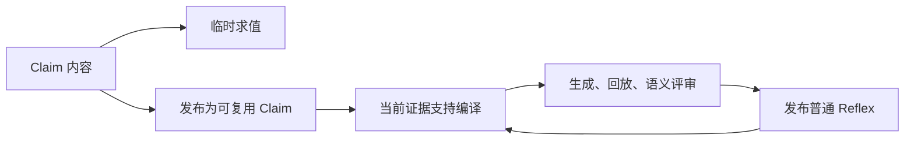

# JEV：Claim 与 Reflex

每一次 JEV 语义判定都表达为 Claim。Claim 只描述判定内容；是否复用、何时调用、如何取证、如何编译和发布，由使用它的组件负责。

```json
{"type":"choice","context":"根据当前记录选择下一步。inspect 表示读取新证据，report 表示报告已确认结果，defer 表示需要补充推理。","options":["inspect","report","defer"]}
```

## 判定内容与结果

Claim 只有 `type`、自然语言 `context` 和有序字符串数组 `options`。事实、选项含义和判定标准直接写入 context；不再增加 Question、criteria 或业务请求对象。

| type | options | Evaluation 的值 |
| --- | --- | --- |
| choice | 2–64 个不同的候选结论 | 数组中的一个字符串 |
| score | 2–10 个从低到高排列的等级 | 加权等级索引，范围为 0 到 options.length−1，可以是小数 |
| noul | 不提供选项 | context 成立的概率，范围为 0 到 1 |

Context 最多 64 KiB，每个选项最多 1 KiB；空内容、重复选项、未知类型和旧字段会被拒绝。评分选项的顺序定义量表；所有 Claim 的内容身份都保留数组顺序。

[Provider](../agent/provider/jev/claim.go)提供封闭的三种类型，[决策协议](../proto/decision/claim.proto)用 oneof 表达结果。阈值和后续动作由调用者决定。批量 Evaluate 的 token 用量属于此次执行；厂商的 state/questions/criteria 请求仅存在于内部传输适配层。

## 职责与生命周期

临时 Claim 可以直接 Evaluate，无需进入库。适用性检查、运行时授权、完成检查以及 guardrail 都使用这一入口。当前证据附加在本次调用的 context 中，记录于决策事件，不改变持久化 Claim。

需要复用的 Claim 可以发布到库。其 ID 由 type、context 和 options 的内容计算；重复发布复用同一个 ID。库记录只额外保存来源任务，快照复制选项数组，发布通过原子持久化完成。生成流程和原生命令共用同一条发布路径。



证据一旦就绪，就在当前边界判断是否编译，包括第一个任务；来源任务不构成等待条件。Claim 定义判断的语义范围，Reflex 持有可执行函数、参数 schema、原生契约、效果次数及验证记录。一个 Reflex 可以覆盖多个 Claim，Claim 不保存“已消费”标记。

编译失败保留 Claim，证据或契约不足时可以保留待验证候选。修复只有通过验证并成功持久化后才替换原 Reflex；失败保留原源码。Reflex 退役也不会删除它覆盖的 Claim，后续证据可以再次触发编译。`learning=frozen` 禁止学习写入，仍允许临时判断和已验证 Reflex 的复用。

持久库使用 `format: "claim/2"`。缺少该版本、旧 Claim 字段或旧库版本直接拒绝加载，不迁移、不重写旧文件。

## 普通 Reflex 的自举

空库从实际交互归纳 Claim，并按同一证据门槛生成普通 Reflex。系统没有专用 bootstrap Reflex、特权 ID、额外源码类型或验证豁免。

安装 JEV 扩展后，现有原生命令提供：

```text
jev status
jev claim <Claim JSON>
jev compile <claim-id> [replace-reflex-id]
```

`status` 读取当前库；`claim` 发布内容并返回 `claim_id`；`compile` 以宿主记录的当前交互请求编译，返回目前覆盖该 Claim 的 `reflex_ids`。返回空数组表示尚无已发布覆盖，编译可能因证据不足或冷却而推迟。替换目标必须已经覆盖所选 Claim。

普通模型和任意普通 Reflex 都可以通过原生 Executor 调用这些操作。`jev-library` 契约将 status 分类为读取，将 claim/compile 分类为库写入；Reflex 中的写入仍需声明效果步骤和次数，通过运行时判定、效果日志与原生验证。命令不能接收调用者编造的轨迹或直接发布源码。编译器只回放已有结果，不执行用户工具。

每次原生调用完成后，宿主立即保存真实结果，供同一执行中的下一次编译使用。在途调用没有结果，不能成为回放证据。原函数替换成功后，已开始的执行继续使用其源码快照，下一次选择使用新库。

## JavaScript 判定桥

`jev` 直接接收 Claim 并返回对应原始值：

```javascript
const next = jev({
  type: "choice",
  context: "根据当前证据选择 inspect、report 或 defer。" + JSON.stringify(currentFacts),
  options: ["inspect", "report", "defer"]
});
const severity = jev({type: "score", context: "评估当前风险。", options: ["低", "中", "高"]});
const complete = jev({type: "noul", context: "当前真实结果已经完成用户请求。" + JSON.stringify(currentResult)});
```

返回值分别是字符串、等级索引和概率。确定性的解析、转换和控制流直接用 JavaScript；只在语义分叉处调用 JEV。旧的 `jev({state,questions}).answers` 形式不再接受。

[生命周期测试](../exts/jev/claim_lifecycle_test.go)覆盖首个证据边界、普通 Reflex 自我替换、失败回滚和退役后的 Claim 保留；[类型测试](../agent/provider/jev/claim_test.go)覆盖序列化、旧字段拒绝、结果类型和数值边界。

## 完整机制验证

[连续链路测试](../exts/jev/claim_pipeline_test.go)从空库启动普通 Agent，经原生 Executor 取得随机回执，归纳 typed Claim，向普通编译 Agent 提交错误参数并接收回放诊断，修复后通过原生契约、回放和独立语义评审发布 Reflex。随后重新加载持久库，以不同目标和相同目标运行三个新任务，检查当前参数、新回执、一次读取、无重新规划或编译，以及冻结库不变。choice、score、noul 都运行这条链路。测试也检查带引号参数的 Bash 解码，以及语义评审收到已解析的真实报告值。

```text
go test ./agent/provider/jev ./exts/jev ./exts/guardrail ./pkg/web/service ./cmd/aiscan -count=1 -timeout 120s
go test -tags 'emptytemplates forceposix full netgo noembed osusergo sqlite' ./agent/provider/jev ./exts/jev ./exts/guardrail ./pkg/web/service ./cmd/aiscan -count=1 -timeout 120s
go test -race ./exts/jev -run 'TestClaim|TestOrdinaryReflex|TestReflexV2(Compiler|Frozen|.*Effect|.*Unknown|.*Steer)' -count=1 -timeout 120s
go test -tags 'full sqlite' ./cmd/aiscan -run '^TestJEVProfileStreamingCompilationRuntimeAndWebReplay$' -count=1 -timeout 120s
```

普通测试只替换模型推理，仍使用真实宿主和验证器。`TestLiveClaimToReflexPipeline` 提供两个明确区分的真实接口模式：设置 `JEV_PIPELINE_LIVE=1` 和 `TYPESAFE_API_KEY`，所有 JEV 判定调用真实接口，LLM 生成仍由固定测试响应提供；额外设置 `JEV_PIPELINE_LLM_LIVE=1`、`CYBER_API_KEY`、`CYBER_BASE_URL`、`CYBER_MODEL`、`CYBER_PROVIDER`，则 Claim 生成、编译、参数提取和最终整理也调用真实 LLM。

```text
go test ./exts/jev -run '^TestLiveClaimToReflexPipeline$' -count=1 -v -timeout 240s
```

可设置 `JEV_PIPELINE_REPORT_DIR` 保存 `pipeline-report.json`、`library.json`、决策日志、原生执行证据和完整 JEV 事件。每次使用新的报告目录，以保证真正从空库启动；日志不记录凭证。真实接口测试会检查完整验收条件，defer、未发布源码、模型调用失败或新任务重新规划都会导致失败，不能作为成功的端到端验证。

## Token 与成本的判定

Reflex 将已验证流程的重复规划变为普通代码执行和有限语义判断，因而可以减少重复任务的 LLM token。节省取决于原流程需要多少推理和历史上下文；一次读取再报告的短任务仍需要参数提取和答案组织，可能没有净节省。

比较时分别记录前台 LLM、Claim 生成、Reflex 编译和 JEV 的输入与输出 token。参数提取计入前台 LLM，不能在前台汇总后再次相加；reasoning 已属于输出 token，不能重复计数。未知用量和失败重试不能当作零成本。不同模型的 token 单位、单价和缓存计费可能不同，所有 Provider token 的合计仅是工作量指标，费用必须按实际单价计算。

设基线每任务用量为 B，复用每任务用量为 W，学习及编译的额外用量为 C；重复 N 个任务后的净节省为 `N × (B − W) − C`。只有 B 大于 W 才能摊薄首次成本；价格不同则将公式中的用量换成实际费用。现有 [A/B 基准](../exts/jev/benchmark_live_test.go)分别报告前台 LLM、全部 LLM、全部 Provider、首次成本、复用费用和回本任务数；[记账测试](../exts/jev/token_accounting_test.go)验证分类汇总、负节省和缺失用量。

2026-10-06 的真实 JEV 链路从空库发布 Reflex，并在三个新任务中各进行一次参数提取和一次答案组织，没有重新规划、生成 Claim 或编译；真实 JEV 判定共消耗 14,439 个复用 token。该运行的 LLM 响应及用量为测试固定值，不能据此报告真实 LLM token 节省率。真实 DeepSeek 模式在首次调用返回 HTTP 402（Insufficient Balance），未完成真实 LLM A/B；目前证据支持机制复用成功，尚不支持“总 token 或费用已降低”的实测结论。
